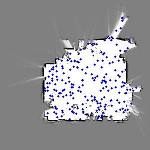
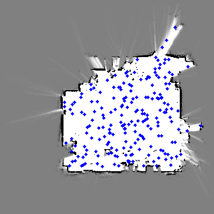

My 2D Monte Carlo Localization (MCL) particle filtering algorithm is implemented in filter.py. You can run python filter.py to start the filtering process. The visualization of the filtering process can be viewed using particle_filtering.rviz.

Please note that due to the implementation in Python and the usage of multiple for loops, the filtering process might be slow. Therefore, I render the results into GIFs for easier visualization.

It's worth mentioning that the filter often crashes when the robot moves near the bottom of the grid. After discovering that, I add resample process to the filter, it will reinitialize particles when the filter crashes due to moving into walls.

The results of my filtering process are displayed below.

Here are some technical details about the implementation:

- The pose of the robot that is visualized is determined by the particle with the largest weight since it represents the most likely pose of the robot.

- visualized rays are rays from scan data, instead of ray tracking

- To improve running efficiency, particles that fall out of the grid or into occupied places are assigned very small weights and are then disregarded in the subsequent steps of the filtering process.

- Messages are extracted from the hw2_data.bag file and synchronized using a function called synchronize_data. This function matches the closest odometry message in time to every scan message because the scan frequency is much lower than that of the odometry messages. This ensures that the odometry and scan data are properly synchronized for accurate localization.

## results
 

(left)gif with only particles 

(right)gif with particles and robot

## How to run it
You will need to install ROS first!
1. run `python filter.py`
2. `rosbag play ./data/hw2_data.bag`
3. run rviz and use config particle_filtering.rviz to see the result, or wait till filter.py finish running, a gif will be rendered under the folder.
